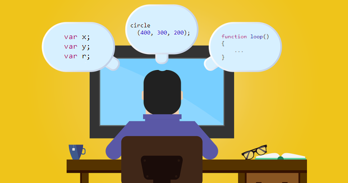

What is ASCII? What is Unicode? These are fundamental questions for computer science.

With this program students are getting the chance to explore the ASCII set and learn about:

-	ASCII and Unicode
-	How to get the code of a character (and vice versa)?
-	Hexadecimal system

Note: If you want to decode ASCII codes, use the [Codes to ASCII](tutorial://ascii_decode) program instead.
 
## Source code 
The JavaScript source code of this program can be found [here](sketches/program.js). To run it, you need to import it in the [codeguppy.com](https://codeguppy.com) online editor. Alternatively, you can use the source code in your p5.js sketches (advanced use). 
## Online version 
To see the code running, check the online playground at [https://codeguppy.com/code.html?t=ascii_codes](https://codeguppy.com/code.html?t=ascii_codes) 
## Next steps 
Please check [codeguppy.com](https://codeguppy.com) for many other fun JavaScript programs and games for beginners. To stay up to date with CodeGuppy development please follow [@codeguppy](https://twitter.com/codeguppy) on Twitter.  
